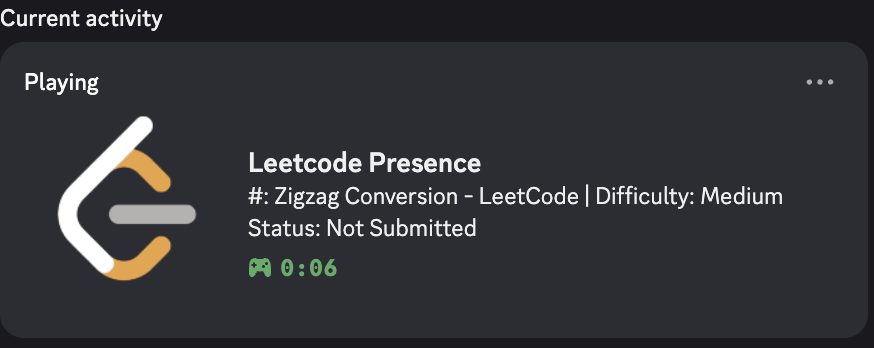

## LeetCode Discord Rich Presence



This project displays your current LeetCode problem, difficulty, language, and status as a Discord Rich Presence.

I used this mini-project to learn about the Go programming language and it's uses.
Was quite confused initially, but I really appreciate how lightweight and versatile it is.

### Features
- Shows problem number, title, and difficulty in Discord
- Displays language and submission status
- Updates automatically as you browse LeetCode

---

## Setup & Usage

### 1. Prerequisites
- Go (1.18+ recommended)
- Node.js (for running the scraper as a browser extension or userscript)
- Discord desktop app (Rich Presence only works with the app)

### 2. Clone the Repository
```sh
git clone https://github.com/Dodf12/LeetcodePresence.git
cd LeetcodePresence
```

### 3. Set Up Discord Application
1. Go to the [Discord Developer Portal](https://discord.com/developers/applications)
2. Create a new application (e.g., "LeetcodePresence")
3. Note the Application ID and add your asset images (e.g., `leetcodelogo`, `leetcode_logo`)
4. Replace the Application ID in `main.go` if needed

### 4. Run the Go Server
```sh
go run main.go
```
You should see logs indicating the server is running and connected to Discord.

### 5. Install the Scraper
- Use the code in `addedExtension/scraper.js` as a browser extension or userscript (e.g., with Tampermonkey)
- Make sure it runs on LeetCode problem pages

### 6. See It in Action
- Open a LeetCode problem in your browser
- The Discord status should update with the problem info

---

## Troubleshooting
- Make sure the Go server is running before opening LeetCode
- The Discord app must be open
- If the number doesn't show, check the browser console and Go server logs for errors

---

## Credits
- Uses [`rich-go`](https://github.com/hugolgst/rich-go) for Discord integration

---

Feel free to open issues or contribute!
